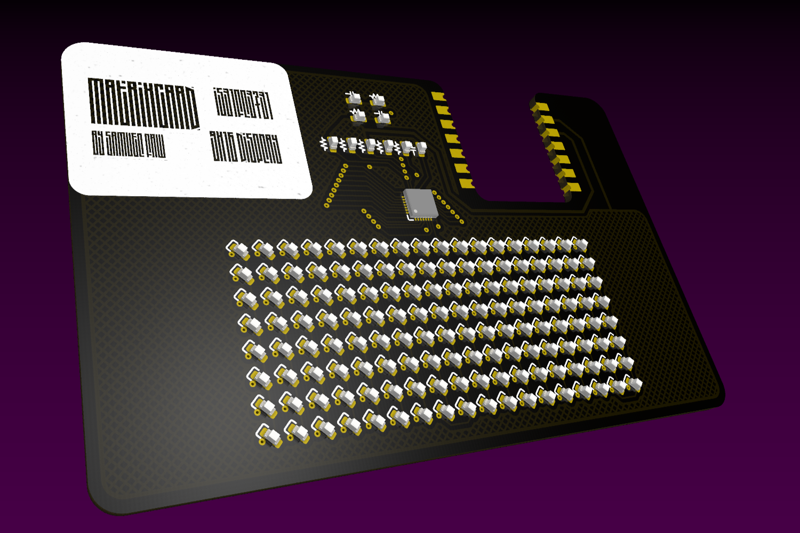
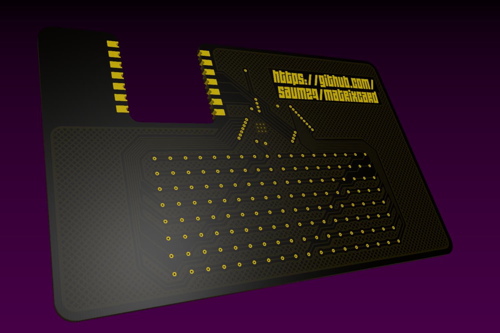

# MatrixCard

|  |  |
| :-------------------------------------------------------: | :----------------------------------------------------: |

## What is it?

The MatrixCard is a basic engineering project I made for school. It is an LED matrix with microcontroller designed to fit in the form factor of a credit card.

### Technical Specifications

- MCU: Seeed Studio XIAO RP2040
- Matrix Controller: Lumissil IS31FL3731 (QFN-28)
- Resolution: 16x9 monochrome
- PCB copper layers: 2
- Dimensions: i forfor CHANGE THIS LATER
- SMD footprints: 0603 (1608 metric)

## But why?????

IDK I thought it would be cool. I also wanted to learn PCB design with KiCAD, this being my first completed project using the software. I also wanted to learn the basics in how to use Git, which I already knew how to use, but had not used in a personal project.

## Can **_I_** make one?????

Of course! I wanted to make this project open source both to showcase it and to allow those who want to iterate on it or just build it themselves to do so.

### Parts needed

Some extra parts are needed. It should be noted that the LEDs listed give enough for 2 MatrixCards, and that the variety pack of SMD components has many extraneous components that are not necessarily needed for assembly. Consult the schematic for resistor and capacitor values.

| part                          | link |
| :---------------------------: | :---------------------------------------------------------------------------------------------------------------: |
| Seeed Studio Xiao RP2040      | [link](https://www.seeedstudio.com/XIAO-RP2040-v1-0-p-5026.html)                                                  |
| Lumissil IS31FL3731           | [link](https://www.digikey.com/en/products/detail/lumissil-microsystems/IS31FL3731-QFLS2-TR/4286473)              |
| 0603 SMD Components (variety) | [link](https://www.amazon.com/0603-Capacitors-Transistors-Electronic-Book/dp/B0B2ZRPCSF?crid=26EKNK0BXYP7U)       |
| 0603 SMD LEDs (300x, blue)    | [link](https://www.amazon.com/uxcell-Lights-Electronics-Components-Emitting/dp/B07DLBC43V?crid=JFB5RWVKTOGE)      |

### Required tools

Some tools are required if you want to build your own MatrixCard

- Soldering iron
- Solder
- Solder Paste and Stencil (recommended)
- Solder Flux (recommended)
- Hot-air rework station (recommended)

## To Do

- add (more) images
- add schematic PDF
- add missing information
- create issues for each entry on this list
